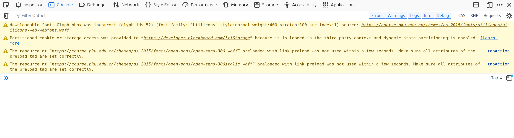
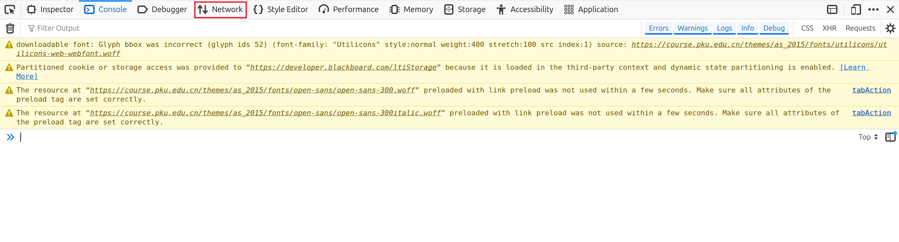
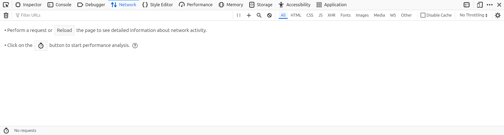
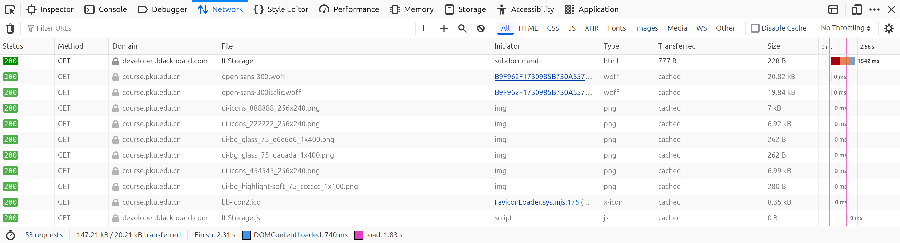
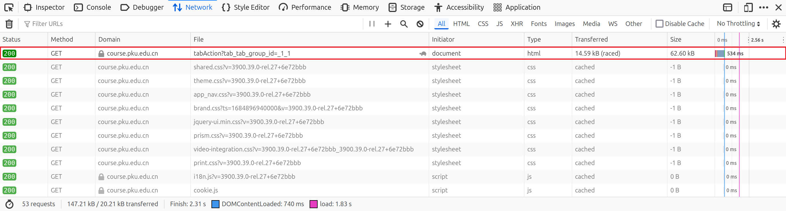
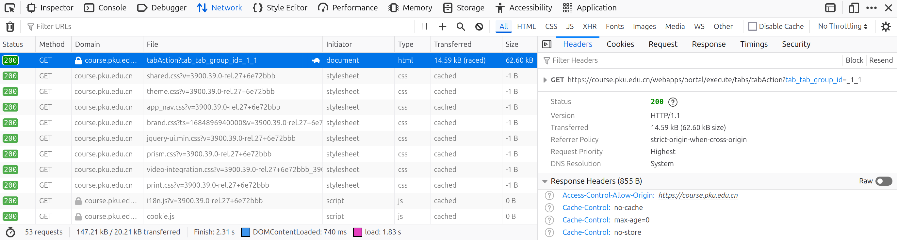
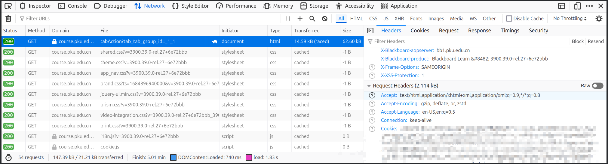

# 北京大学教学网自动下载

这个项目实现北京大学教学网教学内容页面内容的自动下载。

## 安装依赖

安装 `Node.js` ，具体访问[这个页面](https://nodejs.org/en/download)。然后进入项目根目录，执行

```bash
npm i
```

## 获取 Cookie

从教学网获取链接和下载文件需要 Cookie ，可以在浏览器登陆[北京大学教学网](https://course.pku.edu.cn)，然后进入控制台的网络选项，再刷新页面，找到第一个链接，其请求头的 Cookie 即为我们需要的 Cookie 。以[Firefox浏览器](https://www.mozilla.org/en-US/firefox/)为例，登陆后可以按下 F12 ，看到的应该如下图



点击 Network 选项卡



应该看到如下图



刷新（可以按 F5 ），应该看到如下图



向上滑动找到第一个链接，应该看到如下图



点击其，应该看到如下图



点击右侧 Headers 选项卡，下拉找到请求头的 Cookie ，应该如下图



右键选择拷贝值，然后在项目根目录创建一个文件 `cookie.txt` （或者其他的位置和名字都可，但以下的部分假设使用这个文件名，如果你使用其他的，注意对应的修改），将拷贝的内容粘贴到文件中。

## 配置文件

在 [config](./config/) 目录中创建配置文件（其他位置也可以），配置文件类型为 JSON 文件，我们给出了一个示例配置文件 [example.json](./config/example.json) ，可以拷贝修改之，需要指定的包括**教学内容**网页的链接（注意是你想要下载的课程的教学内容网页的链接，不是教学网首页的链接），上一步中你的 Cookie 保存的文件的路径，以及你希望下载的文件目录的路径。

## 运行

在项目根目录运行如下命令

```bash
npm run download <配置文件路径>
```

比如

```bash
npm run download ./example.json
```
